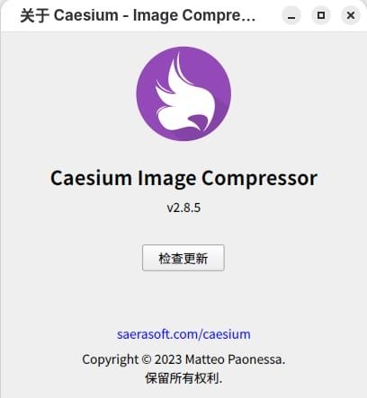
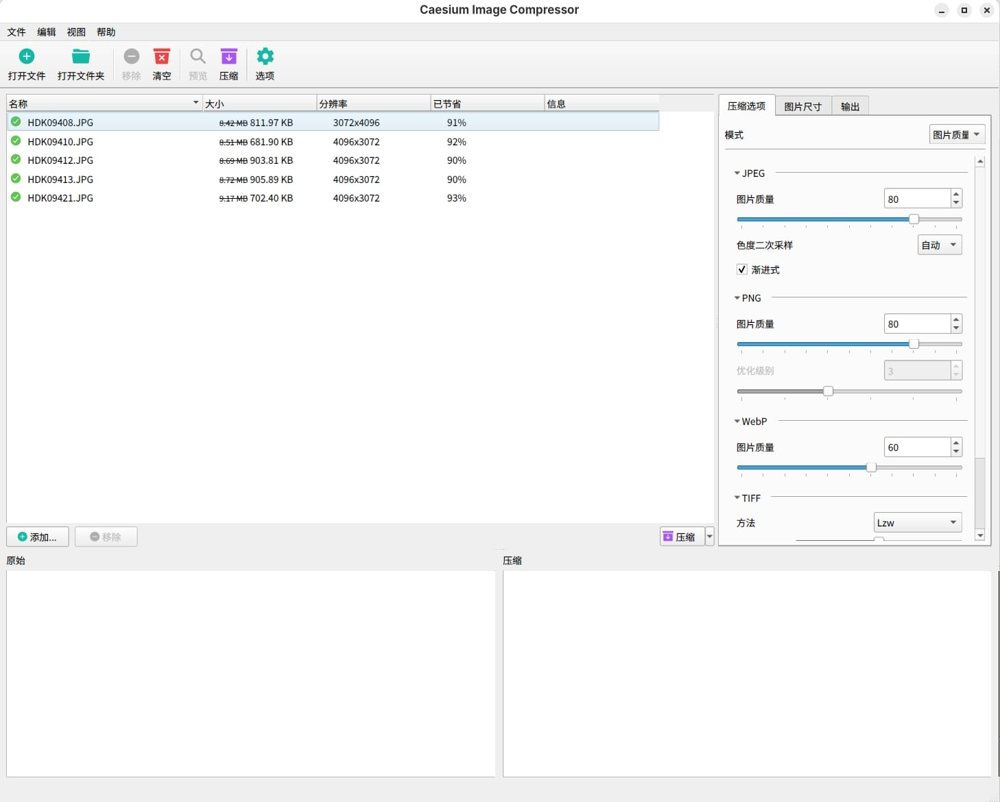
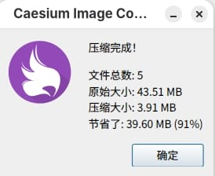

# Caesium Image Compressor — Linux AppImage Build

使用 Docker + linuxdeploy 为 [Caesium Image Compressor](https://github.com/Lymphatus/caesium-image-compressor) 构建 Linux AppImage 包。

Build Linux AppImage packages for [Caesium Image Compressor](https://github.com/Lymphatus/caesium-image-compressor) using Docker + linuxdeploy.

## 快速下载 / Quick Download

Linux 桌面用户可直接从本仓库的 Releases 页面下载最新的 AppImage 制品，即下即用，无需自行构建。

Pre-built AppImage packages are available on the Releases page. Download and run — no build required.

## 使用截图 / Use screenshots





## 自行构建 / Build from Source

```bash
# 0. 克隆本仓库并进入目录
git clone https://github.com/hellodk34/caesium-image-compressor.git
cd caesium-image-compressor

# 1. 构建临时 Docker 镜像
sudo docker build -t caesium-builder -f caesium-builder.Dockerfile .

# 2. 构建 AppImage（如上游有新 tag，需同步更新 build-appimage.sh 中的版本号）
sudo docker run --rm \
    -v "$(pwd)/build-appimage.sh":/build-appimage.sh \
    -v "$(pwd)/output":/output \
    caesium-builder \
    bash /build-appimage.sh

# 3. 产物在 output/ 目录下，修复权限
sudo chown $USER:$USER output/Caesium_Image_Compressor-*.AppImage
```

产物示例: `output/Caesium_Image_Compressor-x86_64.AppImage`

## 构建说明 / Build Notes

- 基础镜像: **ubuntu:22.04**（glibc 2.35，兼容 2022 年后的大多数发行版）
- Qt 版本: **6.8.2**（通过 aqtinstall 安装，与上游 CI 一致）
- libcaesium: 编译过程中自动从 GitHub 拉取并编译
- 打包工具: linuxdeploy + linuxdeploy-plugin-qt

## 测试环境 / Tested Environment

| 项目 | 版本 |
|------|------|
| 操作系统 | Debian 13 (Trixie) |
| 桌面环境 | GNOME 48 |
| 显示协议 | Wayland |
| 架构 | x86_64 |

> 其他发行版或版本未测试，可能存在兼容性问题。

> Other distributions or versions have not been tested.

## 致谢 / Credits

- [Caesium Image Compressor](https://github.com/Lymphatus/caesium-image-compressor) — 原始项目
- [garywill](https://github.com/garywill) — 早期的 Linux AppImage 维护者（最新版 v2.6.0）
- [linuxdeploy](https://github.com/linuxdeploy/linuxdeploy) — AppImage 打包工具
- [aqtinstall](https://github.com/miurahr/aqtinstall) — Qt 安装工具
